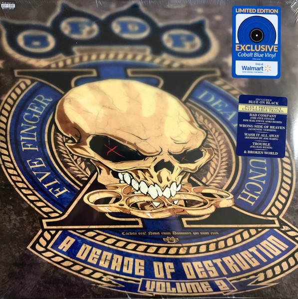

<h2>RECORDS I OWN:</h2>
 

    <h3><u>Nevermind</u></h3>
    

        
        

            <h4>Artist: Nirvana</h4>
            <h4>Genre: Grunge/Alt Rock</h4>
            <h4>Released: 1991</h4>
            <h4>Date Acquired: 4/20/24</h4>
            <h4>Favorite Track: Lithium (A5)</h4>
            <h4>My Album Rating: 8/10</h4>
        

    

    
Nirvana's 2nd studio alubm, I love this album, I listened to a lot of Alt Rock as a younger child and Nirvana is some of the best of it.

    <a href="https://www.discogs.com/release/28947139-Nirvana-Nevermind">Discogs link</a>

 

    <h3><u>Blurry Face</u></h3>
    

        
        

            <h4>Artist: twenty one pilots</h4>
            <h4>Genre: Alt Rock/Indie Rock</h4>
            <h4>Released: 2015</h4>
            <h4>Date Acquired: 4/20/24</h4>
            <h4>Favorite Track: Heavydirtysoul (A1)</h4>
            <h4>My Album Rating: 7/10</h4>
        

    

    
twenty one pilots' third studio album and their most popular one for sure. I bought this from a friend the same time I bought Nevermind, this wasn't the main reason I bought the records, but it definetly grew on me.

    <a href="https://www.discogs.com/release/7224934-Twenty-One-Pilots-Blurryface">Discogs link</a>

 

    <h3><u>Ultimate Sinatra</u></h3>
    

        
        

            <h4>Artist: Frank Sinatra</h4>
            <h4>Genre: Jazz/Pop</h4>
            <h4>Released: 2015</h4>
            <h4>Date Acquired: 12/25/24</h4>
            <h4>Favorite Track: In The Wee Small Hours Of The Morning (A7)</h4>
            <h4>My Album Rating: 6/10</h4>
        

    

    
A compilation record of some of Frank Sinatra's best songs, it definitely delivers that. I do want to eventually buy his actual albums starting with In The Wee Small Hours Of The Morning, but this was a Christmas present that I got alongside my record player so yk.

    <a href="https://www.discogs.com/release/13728415-Frank-Sinatra-Ultimate-Sinatra">Discogs link</a>

 

    <h3><u>One Assassination Under God (Chapter 1)</u></h3>
    

        
        

            <h4>Artist: Marilyn Manson</h4>
            <h4>Genre: Alt Rock</h4>
            <h4>Released: 2024</h4>
            <h4>Date Acquired: 12/25/24</h4>
            <h4>Favorite Track: One Assassination Under God (A1)</h4>
            <h4>My Album Rating: 6/10</h4>
        

    

    
My first introduction to Marilyn Manson and it was pretty good.

    <a href="https://www.discogs.com/release/31137713-Marilyn-Manson-One-Assassination-Under-God-Chapter-1">Discogs link</a>

 

    <h3><u>Minecraft Volume Alpha</u></h3>
    

        
        

            <h4>Artist: C418</h4>
            <h4>Genre: Electronic/Soundtrack</h4>
            <h4>Released: 2011</h4>
            <h4>Date Acquired: 12/25/24</h4>
            <h4>Favorite Track: Moog City (A3)</h4>
            <h4>My Album Rating: 8/10</h4>
        

    

    
Nostalgia at it's finest, this is a peak soundtrack.

    <a href="https://www.discogs.com/release/7375186-C418-Minecraft-Volume-Alpha">Discogs link</a>

 

    <h3><u>Steal This Album!</u></h3>
    

        
        

            <h4>Artist: System Of A Down</h4>
            <h4>Genre: Alt Metal/Nu Metal</h4>
            <h4>Released: 2002</h4>
            <h4>Date Acquired: 1/11/25</h4>
            <h4>Favorite Track: Boom! (A4)</h4>
            <h4>My Album Rating: 10/10</h4>
        

    

    
System Of A Down's 3rd studio album, and my favorite of theirs (although I love every single one of their alubms and they don't have any bad songs).

    <a href="https://www.discogs.com/release/12642690-System-Of-A-Down-Steal-This-Album">Discogs link</a>

 

    <h3><u>Hybrid Theory</u></h3>
    

        
        

            <h4>Artist: LINKIN PARK</h4>
            <h4>Genre: Nu Metal</h4>
            <h4>Released: 2000</h4>
            <h4>Date Acquired: 1/18/25</h4>
            <h4>Favorite Track: Crawling (A5)</h4>
            <h4>My Album Rating: 9.5/10</h4>
        

    

    
LINKIN PARK's first studio alubm, I love this album, it is definetly a classic. Highly recommend this album to anyone even thinking of trying to get into metal.

    <a href="https://www.discogs.com/release/5150478-Linkin-Park-Hybrid-Theory">Discogs link</a>

    <h3><u>Queen – Greatest Hits</u></h3>
    

        
        

            <h4>Artist: Queen</h4>
            <h4>Genre: Pop Rock/Classic Rock</h4>
            <h4>Released: 2020</h4>
            <h4>Date Acquired: 2/14/25</h4>
            <h4>Favorite Track: Don't Stop Me Now (B3)</h4>
            <h4>My Album Rating: 6/10</h4>
        

    

    
Has a pretty good selection of Queen songs, thought I wish it had Under Pressure but otherwise it's a good compilation. I'm personally not the largest fan of complilations as I like to listen to albums in order, it is still good, I also really like the colors of the records themselves.

    <a href="https://www.discogs.com/release/16214031-Queen-Greatest-Hits-">Discogs link</a>

    <h3><u>Five Finger Death Punch – A Decade Of Destruction Volume 2</u></h3>
    

        
        

            <h4>Artist: Five Finger Death Punch</h4>
            <h4>Genre: Nu Metal/Hard Rock</h4>
            <h4>Released: 2020</h4>
            <h4>Date Acquired: 4/20/25</h4>
            <h4>Favorite Track: I Refuse (A4)</h4>
            <h4>My Album Rating: 7/10</h4>
        

    

    
I'm not the most into 5FDP but they are a good band and I got this for easter from my family (even tho im not religious lol). There's a good selection of songs from the band.

    <a href="https://www.discogs.com/release/16257747-Five-Finger-Death-Punch-A-Decade-Of-Destruction-Volume-2">Discogs link</a>

<h2>RECORDS WISHLIST:</h2>

(in no particular order)

 
<ul>
<li>Rage Against The Machine - Rage Against The Machine</li>
<li>Minecraft Volume Beta - C418</li>
<li>Greatest Hits I - Queen</li>
<li>Appetite For Destruction - Guns N' Roses</li>
<li>Three Cheers For Sweet Revenge - My Chemical Romance</li>
<li>The Marshall Mathers LP - Eminem</li>
<li>American Idiot - Green Day</li>
<li>Blue Album - Weezer</li> 
<li>INSIDE - Bo Burnham</li>
<li>Master Of Puppets - Metallica</li>
<li>DISPOSE - The Plot In You</li>
<li>Not Without My Ghosts - The Amity Affliction</li>
<li>The Rise and Fall of Ziggy Stardust and the Spiders from Mars - David Bowie</li>
<li>Greatest Hits - 2PAC</li>
<li>Beetlejuice Original Broadway Cast Recording - Eddie Perfect</li>
<li>The Book of Mormon Original Broadway Cast Recording - Matt Stone, Trey Parker</li>
<li>the first glass beach album - glass beach</li>
<li>Arcane: Season One Soundtrack</li>
<li>Arcane: Season Two Soundtrack</li>
<li>Doom (2016) Soundtrack - Mick Gordon</li>
<li>Dookie - Green Day</li>
<li>The Dark Side of the Moon - Pink Floyd</li>
<li>METAL GALAXY - BABYMETAL</li>
<li>Meteora - LINKIN PARK</li>
<li>The Surface - Beartooth</li>
<li>Sehnsucht - Rammstein</li>
<li>Vol. 3 The Subliminal Verses - Slipknot</li>
<li>Iowa - Slipknot</li>
<li>Slipknot - Slipknot</li>
<li>Hypnotize - System Of A Down</li>
<li>Mezmerize - System Of A Down</li>
<li>Toxicity - System Of A Down</li>
<li>System Of A Down - System Of A Down</li>
<li>Hadestown Original Broadway Cast Recording - Anaïs Mitchell</li>
<li>Hamilton Original Broadway Cast Recording - Lin-Manuel Miranda</li>
<li>in the wee small hours - Frank Sinatra</li>
<li>The Black Parade - My Chemical Romance</li>
<li>Persona 4 Soundtrack - Atlus Sound Team</li>
<li>Persona 4 Golden Soundtrack - Atlus Sound Team</li>
</ul>

