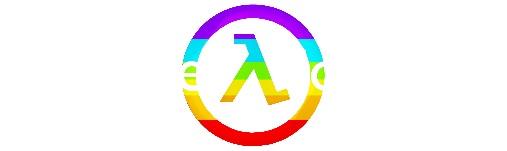
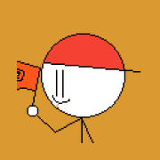

<h2>>cd otherprojects</h2>
<h2>>ls</h2>

    

        <h3>Filegrounds:</h3>
        
        
A games website that you can run from just downloading a zip file and running it in a web browser.

        <a href="https://github.com/The-Ducks-Code/filegrounds">Source Code</a>
         
        <a href="https://the-ducks-code.github.io/filegrounds/">Demo</a>
         
    

    

        <h3>The Mesa Complex:</h3>
        
        
A games website (less outdated lol, tho the homepage is not doing great). 

        <a href="https://github.com/Bored-Entertainment/themesacomplex">Source Code</a>
         
        <a href="https://bored-entertainment.github.io/themesacomplex/">Demo</a>
         
    

    

        <h3>Schoolgrounds:</h3>
        
        
Games website (outdated)

        <a href="https://github.com/Bored-Entertainment/Schoolgrounds">Source Code</a>
         
        <a href="https://bored-entertainment.github.io/schoolgrounds/">Demo</a>
         
    

